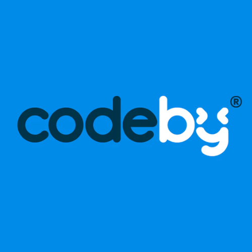

<div>
<div align="center">
  
  <h1>Teste desenvolvido para a posição de Desenvolvedor Front-End na CodeBy</h1>
  <br />
</div>
<main>

## Aplicando:
  - Desenvolvimento das interfaces com React.js;
  - Testes com a biblioteca React Testing Library;
  - CSS Flex-Box Layout;


### Demais ferramentas:
  Editor | DevOps

  
  
  
  
  
## Para rodar locamente:

  1. Clone o repositório com o comando `git clone git@github.com:guihtryb/codeby-my-cart.git` em seu terminal;
  2. Entre na pasta criada codeby-my-cart/frontend com o comando `cd codeby-my-cart/frontend` em seu terminal;
  3. Instale as depêndencias do projeto com o comando `npm install` em seu terminal;
  4. Execute o comando `npm start` em seu terminal e será aberto uma janela com a aplicação rodando no browser;

## Demonstração com valor total maior ou menor que R$10
  
  1. Já na pasta frontend, abra uma instância do seu VScode com o comando `code .` no terminal;
  2. Vá até o arquivo `Provider.jsx` no diretório src/context/
  3. No seguinte trecho de código: 
  ```
  useEffect(() => {
    const endpoint = 'items-above-ten'; // Altere aqui
    getitems(endpoint);
    getTotalPrice(endpoint);
  }, []);
  ```
  - Altere o valor da constante `endpoint` para um dos valores correspondentes às rotas com deploy no heroku:
    - 'items-above-ten': Valor acima de R$10
    - 'items-under-ten': Valor abaixo de R$10
  
  </main>
</div>
